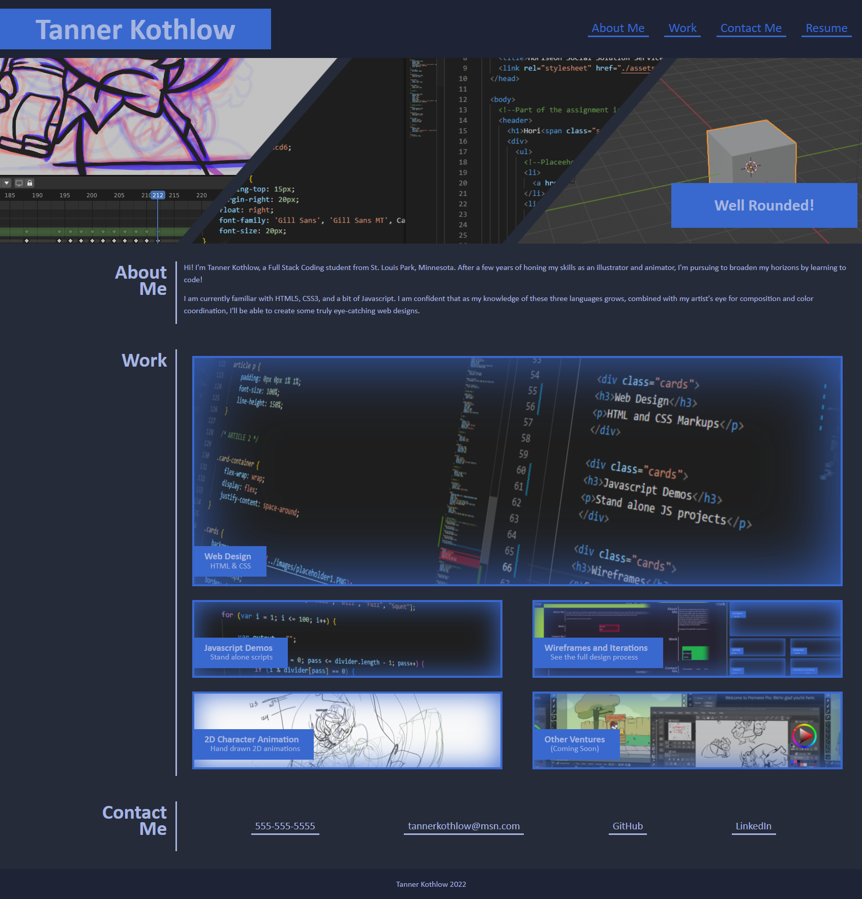
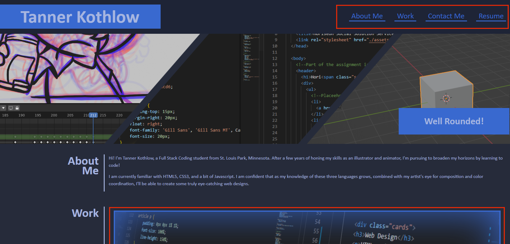
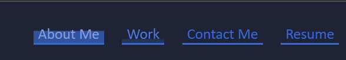
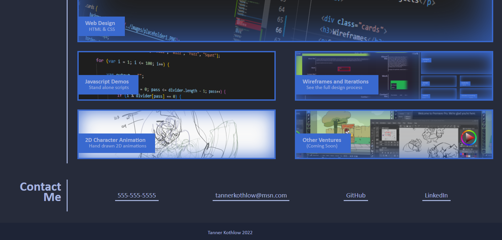

# Week 2: Advanced CSS Portfolio

## Description
For our second assignment in our web development program, we were tasked with creating a whole new website from the ground up, with no prior code. All we had to work from was a mock up, displaying some desired interactivity.

The goals were to use our knowledge of CSS to create a simple and clean looking demo of a possible portfolio site. 

For the header, we had to employ transitions to give the hyperlink bar some visual flair, as opposed to just glowing or changing color when hovered over. Along with that, the header bar remains at the top of the screen while scrolling past the header image using position: sticky.

Next most important was the "Work" category, where we needed to use background images, nth child manipulation, and more drop shadow transitions to create a visual hierarchy and more interactivity. 

Lastly, employing the same hyperlink transitions to the About Me category reemphasizes how CSS can add some subtle interactivity. 

## Instalation 
N/A Already deployed on GitHub pages.
https://tannerkothlow.github.io/Week-2-Portoflio-Prototype/

## Usage 

To see CSS in action, simply hover over any hyperlink or work card, highlighted in red.

Try hovering over the header bar hyperlinks, or anything in the "About Me" section to see a dropshadow transition that moves in one direction.

Try hovering over the Work cards to see some drop shadow transitions as well. Here I'm hovered over the "Javascript Demos" card

## License 
Standard MIT license, coursework.
